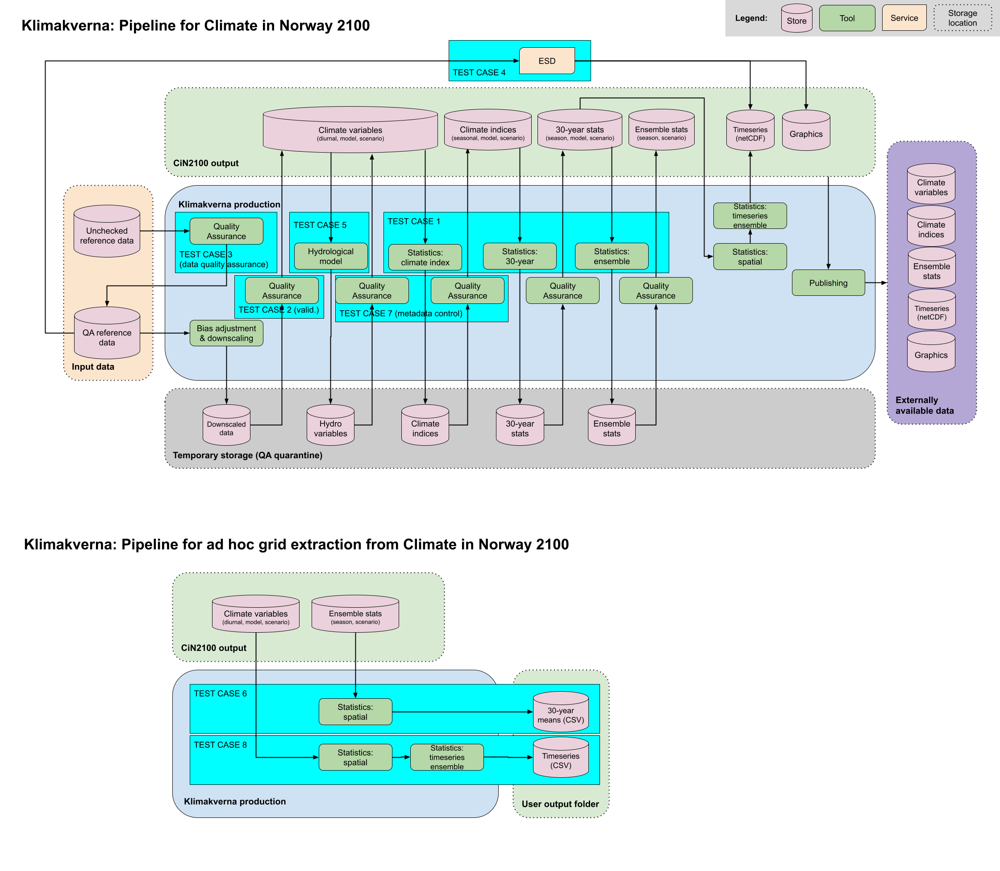

# Klimakverna Pilot 1
This is the main repository for running all the testcases in the pipeline for Climate in Norway 2100. 

Our full pipeline with intended test cases is seen below:


This repository is set-up such that ,we can run testcases that uses and not uses KAPy. 

We have chosen to make a fork repository of KAPy outside this repo,adding some modifications to the original KAPy as per our need to run some of the testcases. 

These modifications added should only be merged to the `develop` branch in KAPy fork repo. The  `main` branch in KAPy fork repository should be kept as it is in original KAPy.

For testcases that uses KAPy ,rules in KAPY fork repository is added as an external module in corresponding testcase.smk in this repository.

```console
module kapy:
    snakefile:
        "/path/to/KAPy/workflow/Snakefile"
    config:config['testcase_1']

use rule * from kapy as kapy_*
```


# Getting started

## Activate environment

Source conda on PPI store-C by 
```console
source /modules/centos7/conda/prod_04_2021/etc/profile.d/conda.sh
```
*klimakverna environment is already created, jump to activate environment*
Create environment for Klimakverna-Pilot1 by go to `/lustre/storeC-ext/users/klimakverna/development/Klimakverna-Pilot1` and run 

```console
conda env create --name=klimakverna -f workflow/envs/environment.yml
```

Activate environment by
```
conda activate ../conda/klimakverna
```

## Configuration

Configuration files are located in the `/config` directory, where the `config.yaml` contains all the configurations for each testcase.

```
testcase_1:
    configurationTables:
        inputs:  'config/inputs_testcase_1.tsv'
        indicators: 'config/indicators_testcase_1.tsv'
        scenarios:  'config/scenarios_testcase_1.tsv'
        periods:  'config/periods_testcase_1.tsv'
        seasons: 'config/seasons.tsv'
    dirs:
        variables: 'outputs/testcase_1/1.variables/time_binning_periods/noresm_hclim'
        indicators: 'outputs/testcase_1/2.indicators/time_binning_periods/noresm_hclim'
        regridded: 'outputs/testcase_1/3.commmon_grid'
        ensstats: 'outputs/testcase_1/4.ensstats/time_binning_periods/noresm_hclim'
        arealstats: 'outputs/testcase_1/5.areal_statistics/time_binning_periods/noresm_hclim'
        plots: 'outputs/testcase_1/6.plots/noresm_hclim'
        netcdf: 'outputs/testcase_1/7.netcdf/noresm_hclim'

    # Configuration options------------------------------------
    arealstats:
        calcForMembers: False
    cutouts:
        method: 'lonlatbox'
        xmin: 4.088
        xmax: 31.761
        ymin: 57.759
        ymax: 71.384
    ensembles:
        upperPercentile: 90
        centralPercentile: 50
        lowerPercentile: 10
    outputGrid:
        regriddingEngine: None
testcase_2:        
        input_json: "config/testcase_2.json"
        mmd_output: "outputs/testcase_2/mmd"
        nc_output: "outputs/testcase_2"
        input_base: "inputs/testcase_2/"

```  


## setting up new rules

- A testcase.smk is created for each testcase in the directory `./workflow/rules`.
- And this .smk file is included in the `.workflow/Snakefile`
- Specify the outputs for these newly added rules in  `rule all` as `inputs`


## Run calculation

To check that configuration is valid and how many output files that will be generated, a dry run in snakemake is run by 

```console
snakemake -n
```

in the terminal. If everything is ok, the calculation is started by

```console
snakemake --cores 1
```

Run on PPI with qsub

```console
qsub -V -b n -cwd <filepath>
```
where the filepath is to the run script which is run_snakemake.sh. Remember to change to your own mail in the run script.
Check queue by 

```console
qstat -q <queue_name> -u <user_name>
```
where the `queue_name` is `all.q` as given in the run script.

Delete job by running

```console
qdel <job_id>
```

The console output of the job is stored in `/lustre/storeC-ext/users/klimakverna/development/jobs/ERR_Klimakverna.<job_id>`.


## Output

The output files from one calculation is saved in `.../lustre/storeC/development/output/`, where the different subdirectories correspond to the testcases. 

# Git guidelines
- Create smaller manageable issues as you see fit.
- When working on an issue, create a branch and commit there.
- Always make a merge (pull) request when creating a branch.
- Always merge main into branch first before merging branch into main.
- Merge back into main branch regularly, ideally when completing an issue. If it takes longer, discuss with group
- Use pull requests for code review by assigning each other as reviewers.

# Folder structure
The main location of the repository is on PPI-ext, the user folder klimakverna is the base folder:
```
<base>/development/Klimakverna-Pilot1
```
We use the same conda environment, which we keep in a sister folder:
```
<base>/development/conda
```
In each test case, we regard Climate in Norway file locations as valid input. In this way, test cases should generally not depend on each other. Output is stored in appropriate subfolders here:
```
<base>/development/output/
```
